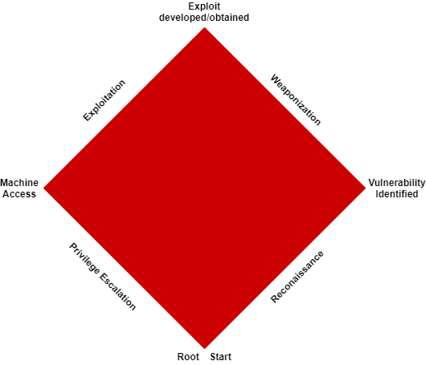
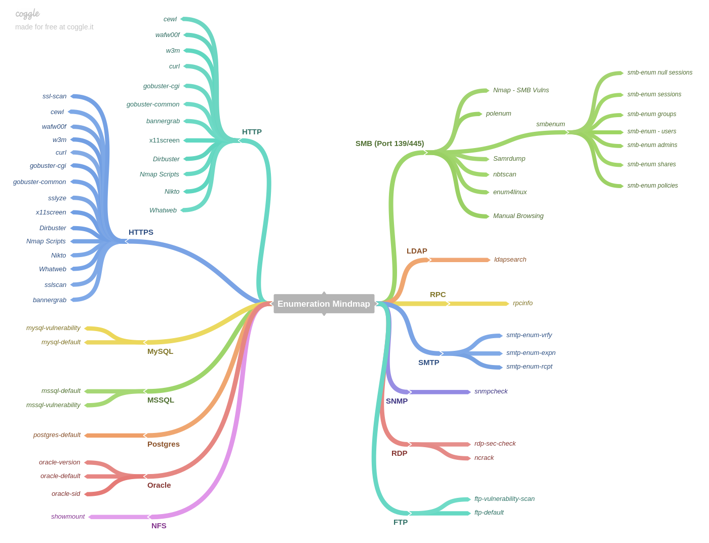

# Red Diamond

The Red Diamond is a condensed and easier to follow version of the Cyber Kill Chain. It consists of 4 milestones that are to be achieved through 4 phases.
 * Milestones:
    * ID Vulnerability
    * Developed/Obtained Exploit
    * Machine Access
    * Root
 * Phases:
    * Reconnaissance
    * Weaponization
    * Exploitation
    * Privilege Escalation



Before we dive into the methodology of the red diamond, we're going to compare hacking architectures.

## Hacking Platform Comparison
The operating system you decide to use to conduct a penetration test is crucial to minimize the headaches that come with it. While it is true that many of these systems contain similar tools (or they can be easily downloaded), the feel and function of the operating system is what really matters. I will quickly compare two popular platforms (that I have used) along with a potential alternative I know some may try to utilize.

### Kali Linux


[Kali](https://www.kali.org/) is a Debian-based Linux distro that emphasizes penetration testing and security auditing. The distro is maintained by Offensive Security, a well-known cyber security company and the creators of OSCP.

#### Features
* Free
* Over 600 penetration testing tools pre-installed covering tasks such as penetration testing, security research, computer forensics, web testing, and reverse engineering.
* Customizable interface
* Wireless interface support (i.e. WI-FI dongle)

### Parrot OS


[Parrot](https://www.parrotsec.org/) is an open-sourced Debian-based Linux distro that emphasizes security, privacy, and penetration testing. The distro is maintained by the Parrot project and whoever seeks to contribute to the operating system. It has a similar toolset to Kali and comes with a 'home' feel as well.

#### Features
* Free
* Universal compatibility
* Lightweight
* Secure

### Comparison
Both distros come configured for an emphasis in cyber security and penetration testing. As such, the real difference between the distros comes down to hardware requirements and individual preference.

#### Hardware Requirements
| Parrot OS  | Kali Linux  |
|---|---|
| No Graphical Acceleration Required.  | Graphical Acceleration Required.  |
| Minimum 320MB RAM is needed.  | Minimum 1GB RAM is needed.  |
| A minimum of 1GHZ dual-core CPU is needed.  | A minimum of 1GHZ dual-core CPU is needed.  |
| It can boot in both legacy and UEFI forms.  | It can also boot in both legacy and UEFI forms.  |
| At least 16GB of disk space is needed to install the operating system.  | At least 20GB of hard disk space is needed to install the operating system.  |

Parrot OS is better suited for those who have older systems or those who want to preserve as much disk space and RAM as possible.

#### Preference
As i previously stated, it all comes down to personal preference. I have used both Kali and Parrot, and personally prefer Parrot. In my experience, Kali is a bit laggy when running on the minimum requirements and it crashed frequently (sometimes it was my fault but still). Parrot on the other hand has not crashed nor lagged in performance when multi-tasking in the 5 months I've been using it. In fact on Parrot I am able to see CPU and network usage by the system as I run commands, so it is easier to predict and prevent a system crash with this distro. I will note that Parrot is missing a few tools that you can find on Kali, but they are easier to install.

#### Alternative
For those who refuse to download a virtual machine and are running Windows, you maybe leaning towards utilizing Windows Subsystem for Linux (WSL) as your hacking platform. In my opinion, while this __MAY__ work, I highly advise against it. You should not conduct a penetration test from your primary machine, especially if you're required to VPN into a network with known hackers. There's always a chance that your system may either be accidentally or intentionally scanned and exploited; it is better if they get on a virtual machine that you can just re-install/revert to a snapshot instead of your primary machine.

*__NOTE__*: if you're running a different linux distro, you can easily install tools on that distro as need be, you just may have to install a bunch of dependencies first.

## Reconnaissance
In the Reconnaissance phase, you understand the target by using both passive and active methods such as Open-Source Intelligence (OSINT) and network scanning. To successfully complete this phase, you need to conduct a port scan and enumerate the running services to identify a vulnerability.

### Port Scan
A port scan is a technique used to identify open ports and services available on a machine. Open ports in other words are 'doors' that allow you access to a machine in some retrospect. While there are many tools that make this technique easy, I am going to focus on the most popular one, nmap.

#### NMAP
The Network Mapper, or nmap for short, is an open-sourced network scanner that discovers hosts and open ports that comes pre-installed in many penetration testing distros. Nmap has the ability to perform OS detection, host discovery, software version detection, port status, and vulnerability scanning.

The basic syntax for scanning a machine is as follows:
```
nmap <TARGET IP>
```
This command will scan 1000 common TCP ports on the machine and identify whether a port is open, closed, or filtered. The ports you want to focus on are the open ports, since they will be the easiest attack vector. Filtered ports indicate some sort of firewall is active on the machine filtering traffic on that port (in other words, it'll be harder to get in through that port). If you see a closed port, well don't bother, you won't get in with that port.

Now I will move into my method of scanning the machine with nmap. To keep this concise, I will not go through every single flag available on nmap. If you want to see this information, go [here](https://nmap.org/book/port-scanning-options.html) or just run 
```
man nmap
```
or
```
nmap --help
```
The way I found that grabs ports quickly, while minimizing missed ports is the following command:
```
ports=$(nmap -p- --min-rate=1000 -T4 <TARGET> | grep ^[0-9] | cut -d '/' -f 1 | tr '\n' ',' | sed s/,$//)
```
```
-p-                 Check all 65,535 ports
--min-rate          Send this amount of packets per second (minimum)
-T4                 Aggressive timing control (prohibits scan delay from exceeding 10 ms)
grep ^[0-9]         Locate all numbers
cut -d '/' -f 1     Take everything before the first slash
tr '\n' ','         Replace newlines with commas
sed s/,$//          Remove trailing comma
```
After this command finishes, when you echo the $ports variable you should see an output in this format
```
21,22,80
```
Wit the ports in this format, I am able to simply add them to the primary port scan:
```
nmap -p $ports -sV -sC <TARGET> -oA initial
```
```
-p $ports       Scan these ports
-sV             Version detection
-sC             Run default scripts against the specified service
-oA initial     Output to nmap, xml, and gnmap files       
```
When this completes, I have three files with the output from the scans. Hopefully the scan identified software versions or some vulnerabilities to make my enumeration easier. Realistically, this is rare, but it does most of the time identify some juicy information.

*__NOTE__*: If you scan the target or check the ports and see that only one port is open that's hard to exploit (i.e. port 22), then wait a minute and re-run the command. This is likely caused by a slower network connection or the machine was scanned as it came online.
*__NOTE2__*: You can combine these two commands into one `nmap -p- -sC -sV <TARGET> -oA initial`. I do not like this method as it is time-consuming since it will try to find the software version and run scripts against __ALL__ 65,535 ports. I found that this command takes about 7 minutes minimum to run while the above two finish in 2-3.

### Service Enumeration
Once I identified ports I start my enumeration. Hopefully the scan identified some software versions and some juicy details about the service running to help narrow down what I will enumerate first. During this time I utilize Google and [Exploit-DB](https://www.exploit-db.com/) to help identify vulnerabilities in software (Exploit DB is also accessible with the [searchsploit](https://www.exploit-db.com/searchsploit) command). If nmap identified software versions, I immediately check Google and Exploit-DB to see if any exploit is available and works. Otherwise, I proceed with enumeration. Below I am going to list some techniques for common services that are typically found. At the end of this section, I will also include a mindmap for all services found.

#### Port 21 (FTP)
FTP enumeration is very simple. To connect, simply execute:
```
ftp X.X.X.X 21
```
From here try to login as anonymous with no password (hopefully nmap already identified this). If this fails, FTP enumeration stops here until I find valid FTP credentials (If that even happens).

Assuming I do have access to the ftp server, I use the `ls` command to see if there are any interesting files I can grab. If so, I use the `get` command to download said file to my machine. FTP is really a service to grab files sensitive files from. You can upload a reverse shell to the service with `put`, but that is a rare occurrence (in my experience).

#### Port 22 (SSH)
So enumeration of SSH is trivial. This port is usually the most secure (for obvious reasons) so I usually don't bother testing SSH. If I run out of ideas, I will test root access to ssh with `root@X.X.X.X`. Hopefully the administrator was lazy and left root access without a password enabled (highly unlikely btw). If that fails, then use Exploit-DB and Google to see if there are any known vulnerabilities with the SSH version. It is important to note that, you will find vulnerabilities with SSH, but usually they fail because it requires __POOR__ configuration of SSH (i.e. That admin will be fired).

#### Port 25 (SMTP)
SMTP enumeration often requires valid email credentials. I have not really done enumeration of SMTP so check the mindmap for the commands you can use.

#### Port 80/443/8080 (HTTP/HTTPS)
A web service is often the most common service you will find running on a machine. As such, there are many ways to enumerate a web server. I am going to highlight three simple methods I use to enumerate a web service: Nikto, Gobuster, and Manual.

##### Nikto
Nikto is an open-source web scanner that scans for dangerous files/CGIs, outdated software, and many other things. This scanner in simpler terms, scans __EVRYTHING__ related to the web server. It is important to note that Nikto will take a hot-minute to finish (sometime up to 20 minutes) to completely run nor does it find directories (asides from ones with known vulnerabilities). I usually only run Nikto as a last resort if I cannot find anything via manual enumeration and gobuster. To run and save the output to a file run:
```
nikto -h X.X.X.X -o nikto.txt
```
Check [here](https://tools.kali.org/information-gathering/nikto) for command-line arguments.

##### Gobuster
[Gobuster](https://github.com/OJ/gobuster) is a tool used to brute force directories, files, subdomains, and virtual hosts on a web server. I like using this tool since it is not resource heavy and I can brute force folders and files with various extensions simultaneously. I run gobuster with the following parameters (example on a web server located on port 80):
```
gobuster dir -u http://X.X.X.X -w /usr/share/wordlists/dirb/common.txt -x php,txt -t 50 -s 200,301 -o go.txt
```
```
-u  URL
-w  Wordlist
-x  Extension
-t  # of concurrent threads
-s  Only show responses with these status codes
-o  Output file
```
I want to highlight two flags I used, -x and -s. Web servers usually run php as the backend and contain php and txt files. I have also encountered aspx and html files but those are not as common. When brute-forcing directories I am only interested in those with 200 and 301 status codes. A 200 status code indicates that the resource is available and present at that exact address. A 301 code indicates a redirection, common when a valid directory is found.

##### Manual
Manual enumeration of the web server is actually simple. It involves reviewing cookies, the source-code of the page and interacting with the web page. To review cookies simply get a cookie editor add-on; these are available on just about every browser. To review the source code right click on the web page and select either view source or inspect element (interactive code viewer). I have found new directories, files, credentials, and even a SQL injection vulnerability just by reviewing the source code. Lastly if applicable, I interact with the service. For example, if it's a blog I review all entries to see if any confidential information is reviewed that was not found with scripts.

#### Port 139/445 (SMB)
A SMB server is one of the most common services you will find on a Windows box. Linux has them too, but not as often. SMB in a nutshell, is a communication protocol that enables shared access to things such as files, printers, etc. The main way I enumerate SMB servers is with Smbclient.

##### Smbclient
[Smbclient](https://www.samba.org/samba/docs/current/man-html/smbclient.1.html) is a tool that enables one to interact with a SMB server. The interface is very similar to ftp (get and put commands are the same) that allows one to view, download, and upload to a SMB share. To determine what shares are accessible I run the following command.
```
smbclient -L \\\\X.X.X.X
```
This command will attempt to login to the SMB share anonymously and list the shares. This will work most of the time, but if the admin restricted the server, then valid credentials will be needed.

After I identify the share I want to target, I connect to the share with:
```
smbclient \\\\X.X.X.X\\{share}
```
From here I turn recursive listing on with `recurse on` and the run `ls` to view everything in the share. From here I determine whether I want to download some files with `get` or upload a reverse shell with `put`.

**NOTE**: If you prefer an automated version, use [Smbmap](https://tools.kali.org/information-gathering/smbmap)

##### NMAP
As I stated previously, nmap comes with the ability to scan for vulnerabilities a service may have. SMB is one of the easier services to test with this method since it is vulnerable to a plethora of things. To do this I simply run:
```
nmap -p 139,445 --script smb-vuln* X.X.X.X -oA smb
```
The * is a wildcard that essentially means run every smb vulnerability script on the target. Usually with this I receive some kind of vulnerability that I may be able to exploit.

After the enumeration is complete and I have identified the vulnerability, I proceed to develop/obtain the exploit.

### Service MindMap


## Weaponization
In the Weaponization phase, you develop your exploit for the target. This can either be done by writing your own code or using someone else's. I don't have to go into detail about writing your own exploit (self-explanatory) but when using a publicly-available exploit (from Exploit-DB or somewhere on Google), some configurations may have to be made. For example, say there's an exploit for Apache written in python, before I even try to download and run the exploit I review the source code. I identify whether there are any dependencies I need to install or if the IP/Port/URL is hardcoded in. If this is the case I modify the exploit accordingly after I download it. If I use a Metasploit module, I list the options with `show options` and set the required options.

If the exploit initiates a reverse shell, I need to have a [netcat](https://www.sans.org/security-resources/sec560/netcat_cheat_sheet_v1.pdf) listener running. I like to encompass my netcat listener with [rlwrap](https://github.com/hanslub42/rlwrap) so that my netcat connection will function like a normal shell. Normally you wont be able to edit your command or quickly use a previous one without deleting the appropriate portion of the command.

If the exploit requires a windows executable as a reverse shell or some shellcode, I generate these with [msfvenom](https://www.offensive-security.com/metasploit-unleashed/msfvenom/). I like msfvenom since it allows me to create either a meterpreter payload, a normal tcp connection, or shell code to be used in a python exploit.

With this complete, I now have an exploit that is ready to be used

## Exploitation
In the Exploitation phase, this is honestly the most straightforward phase. Run the exploit. If it's successful, I'm now in the privilege escalation phase. If it fails, I revert back to the Weaponization phase and try to identify the error.

**__NOTE__**: Multiple unsuccessful exploits may indicate the service has been patched for that vulnerability, thus I will revert back to the Reconnaissance phase to find another vulnerability.

## Privilege Escalation
In the Privilege Escalation phase, I seek to obtain root privileges. To do this, first I identify what operating system I'm on (This is usually indicated from the nmap scan). Below I will detail the steps I take to escalate privileges on a Linux host and a Windows host.

### Linux
When I try to escalate privileges on a Linux host, I follow this checklist:
1. Kernel Exploit
2. Sudo Privileges
3. Processes ran as root
4. Root owned files

#### Kernel Exploit
A kernel exploit is the holy grail for privilege escalation. It requires little work and is usually identifiable within seconds. To do this, I first check the system kernel with `uname -a`. This command outputs the kernel version along with some information about its architecture (x64 or x86_x64). Next I use Exploit-DB to identify if the kernel has any exploits. If it does, I download, compile, transfer the exploit to the machine, and run. If all goes well i will have a root shell, otherwise I can either try another exploit (if applicable), or move on to the next item in my checklist.

#### Sudo
Sudo privileges are my second favorite option for escalating privileges. If I have a user shell, not as a service (i.e. www-data), then I can check these privileges with the following command `sudo -l`. This will list out what privileges this user has in the context of sudo.

For example, lets say I have a shell as randomuser, check its sudo privileges, and get the following output:
```
randomuser  ALL=(ALL:ALL) ALL
```
To clarify what this means:
* The first ALL is the users allowed to use the sudo command. 
* The second ALL defines the hosts (servers) on which sudo can be employed. 
* The third ALL is the user you are running the command as.
* The last ALL defines the commands allowed.
In this scenario, randomuser is essentially root. I can change just about anything in the system to fit my needs without actually having a root shell.

Now lets say I run `sudo -l` and see this in the output:
```
(root) NOPASSWD: /sbin/reboot
```
This indicates that I am able to execute the reboot command as root, without a password. This is especially handy if there's a service that starts upon reboot that I can hijack.

Now let's say I see this in the output of `sudo -l`:
```
/usr/bin/sudo /usr/bin/journalctl -n99 -fake.service | /usr/bin/cat
```
Here the user will execute the journalctl service as root. This can be exploited via a [GTFOBin](https://gtfobins.github.io/gtfobins/journalctl/) to get a root shell.

#### Root Processes
Hijacking/Exploiting root processes is a common vector for privilege escalation. To do this, I simply have to identify the process running as root. This can be done with the following command:
```
ps aux | grep root
```
From this output, I can identify root services and research them to determine if there are known exploits.

#### Root Files
Hijacking a root-ran file is something I discovered recently. Essentially, I look for executable files owned by root, that have global write [permissions](https://www.guru99.com/file-permissions.html). If I find one, I simply inject a reverse shell into the script and run it. If successful, I have obtained a shell as the root user.

__NOTE__: You can also use [LinEnum](https://github.com/rebootuser/LinEnum) or [linPEAS](https://github.com/carlospolop/privilege-escalation-awesome-scripts-suite/tree/master/linPEAS) to automate enumeration on the machine. I have included copies in this repository

### Windows
Windows Privilege Escalation is honestly my weakest skill, yet it is very similar to Linux. To elevate my privileges, I follow the following checklist:
1. Kernel Exploit
2. User Privileges
3. Processes ran as SYSTEM
4. Unquoted Service Paths

#### Kernel Exploit
A kernel exploit is the holy grail for privilege escalation. It requires little work and is usually identifiable within seconds. To do this, I first check the system kernel with `systeminfo`. This command outputs the OS version along with some information about its architecture. Next I use Exploit-DB to identify if the kernel has any exploits. If it does, I download, compile, transfer the exploit to the machine, and run. If all goes well i will have a SYSTEM shell, otherwise I can either try another exploit (if applicable), or move on to the next item in my checklist.

#### User
User privileges on a windows machine are a common vector to elevate privileges. Why? Security researchers identified a number of vulnerabilities with certain privileges and made the exploits public. To figure out if the machine I'm on has any user privilege vulnerabilities, I run:
```
whoami /all
```
and start Googling.

__Note__: If you're on a Windows XP machine, whoami is an invalid command since it was developed after Windows XP. Just run winPEAS to bypass this.

#### SYSTEM Processes
This is very similar to Linux, the goal here is to find processes running as SYSTEM, and try and hijack them with a reverse shell. One command that will determine SYSTEM processes:
```
tasklist /v /fi "username eq system"
```
From here I want to check the permissions of the processes binaries:
```cmd
for /f "tokens=2 delims='='" %%x in ('wmic process list full^|find /i "executablepath"^|find /i /v "system32"^|find ":"') do (
	for /f eol^=^"^ delims^=^" %%z in ('echo %%x') do (
		icacls "%%z" 
2>nul | findstr /i "(F) (M) (W) :\\" | findstr /i ":\\ everyone authenticated users todos %username%" && echo.
	)
)
```
Lastly, I want to check the permissions of the folders of the binaries, to see if it's vulnerable to DLL hijacking
```cmd
for /f "tokens=2 delims='='" %%x in ('wmic process list full^|find /i "executablepath"^|find /i /v 
"system32"^|find ":"') do for /f eol^=^"^ delims^=^" %%y in ('echo %%x') do (
	icacls "%%~dpy\" 2>nul | findstr /i "(F) (M) (W) :\\" | findstr /i ":\\ everyone authenticated users 
todos %username%" && echo.
)
```
#### Unquoted Service Paths
This is an interesting vulnerability I learned about not too long ago. In a nutshell, if the path to an executable is not encompased in quotes (i.e C:\Program Files\Some.exe instead of "C:\Program Files\Some.exe") Windows will try to execute the first executable it finds as it moves down the path. This essentially means I can throw a reverse shell in the path, restart the service and I should get a callback. To identify vulnerable services, run:
```cmd
wmic service get name,displayname,pathname,startmode | findstr /i /v "C:\\Windows\\system32\\" |findstr /i /v """
```
__NOTE__: You can also use [winPEAS](https://github.com/carlospolop/privilege-escalation-awesome-scripts-suite/tree/master/winPEAS) to automate enumeration on the machine.