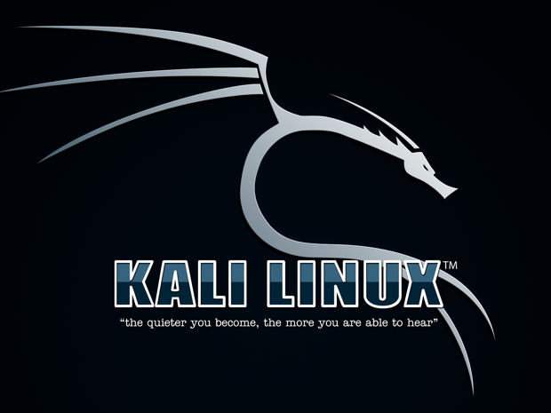

# Red Diamond

The Red Diamond is a condensed and easier to follow version of the Cyber Kill Chain. It consists of 4 milestones that are to be achieved through 4 phases.
 * Milestones:
    * ID Vulnerability
    * Developed/Obtained Exploit
    * Machine Access
    * Root
 * Phases:
    * Reconnaissance
    * Weaponization
    * Exploitation
    * Privilege Escalation

Before we dive into the methodology of the red diamond, we're going to compare hacking architectures.

## Hacking Platform Comparison
The operating system you decide to use to conduct a penetration test is crucial to minimize the headaches that come with it. While it is true that many of these systems contain similar tools (or they can be easily downloaded), the feel and function of the operating system is what really matters. I will quickly compare two popular platforms (that I have used) along with a potential alternative I know some may try to utilize.

### Kali Linux

[Kali](https://www.kali.org/) is a Debian-based Linux distro that emphasizes penetration testing and security auditing. The distro is maintained by Offensive Security, a well-known cyber security company and the creators of OSCP.

#### Features
* Free
* Over 600 penetration testing tools pre-installed covering tasks such as penetration testing, security research, computer forensics, web testing, and reverse engineering.
* Customizable interface
* Wireless interface support (i.e. WI-FI dongle)

### Parrot OS

[Parrot](https://www.parrotsec.org/) is an open-sourced Debian-based Linux distro that emphasizes security, privacy, and penetration testing. The distro is maintained by the Parrot project and whoever seeks to contribute to the operating system. It has a similar toolset to Kali and comes with a 'home' feel as well.

#### Features
* Free
* Universal compatibility
* Lightweight
* Secure

### Comparison
Both distros come configured for an emphasis in cyber security and penetration testing. As such, the real difference between the distros comes down to hardware requirements and individual preference.

#### Hardware Requirements
| Parrot OS  | Kali Linux  |
|---|---|
| No Graphical Acceleration Required.  | Graphical Acceleration Required.  |
| Minimum 320MB RAM is needed.  | Minimum 1GB RAM is needed.  |
| A minimum of 1GHZ dual-core CPU is needed.  | A minimum of 1GHZ dual-core CPU is needed.  |
| It can boot in both legacy and UEFI forms.  | It can also boot in both legacy and UEFI forms.  |
| At least 16GB of disk space is needed to install the operating system.  | At least 20GB of hard disk space is needed to install the operating system.  |

Parrot OS is better suited for those who have older systems or those who want to preserve as much disk space and RAM as possible.

#### Preference
As i previously stated, it all comes down to personal preference. I have used both Kali and Parrot, and personally prefer Parrot. In my experience, Kali is a bit laggy when running on the minimum requirements and it crashed frequently (sometimes it was my fault but still). Parrot on the other hand has not crashed nor lagged in performance when multi-tasking in the 5 months I've been using it. In fact on Parrot I am able to see CPU and network usage by the system as I run commands, so it is easier to predict and prevent a system crash with this distro. I will note that Parrot is missing a few tools that you can find on Kali, but they are easier to install.

#### Alternative
For those who refuse to download a virtual machine and are running Windows, you maybe leaning towards utilizing Windows Subsystem for Linux (WSL) as your hacking platform. In my opinion, while this __MAY__ work, I highly advise against it. You should not conduct a penetration test from your primary machine, especially if you're required to VPN into a network with known hackers. There's always a chance that your system may either be accidentally or intentionally scanned and exploited; it is better if they get on a virtual machine that you can just re-install/revert to a snapshot instead of your primary machine.

*__NOTE__*: if you're running a different linux distro, you can easily install tools on that distro as need be, you just may have to install a bunch of dependencies first.

## Reconnaissance
In the Reconnaissance phase, you understand the target by using both passive and active methods such as Open-Source Intelligence (OSINT) and network scanning.

## Weaponization

## Exploitation

## Privilege Escalation
